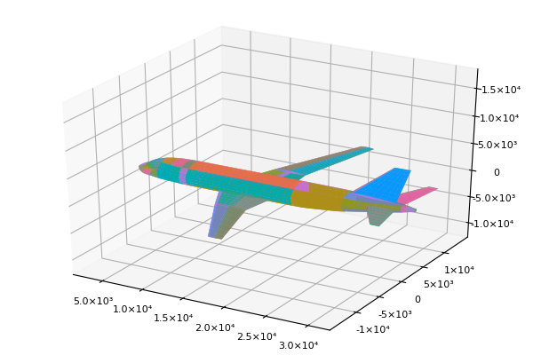

# ParametricSurfaces.jl

*A simple package to generate some basic parametric shapes for testing Nystrom methods* 

<!--


 -->


[](http://codecov.io/github/maltezfaria/ParametricSurfaces.jl?branch=master)

## Installation
Install from the Pkg REPL:
```
pkg> add https://github.com/IntegralEquations/ParametricSurfaces
```

## Usage

The most basic use case is to create some simple shape, and then compute a quadrature of the shape:
```julia
    using ParametricSurfaces
    # create a geometry 
    geo = Bean(center=(0,0,0),paxis=(1,1,1))
    # generate a tensor quadrature with 10 points per patch per direction
    quad = TensorQuadrature((10,10),geo)
    # plot 
    using Plots
    pyplot()
    plot(quad)
```
You can also refine globally by splitting:
```julia
    refine!(geo)
    quad = TensorQuadrature((10,10),geo)
    plot(quad)
```
or split a given part:
```julia
    geo = Bean()
    refine!(geo.parts[1])
    quad = TensorQuadrature((10,10),geo)
    plot(quad)
```

See the [tests](./test/runtests.jl) for more.

## Integration with GMSH

There is currently some experimental integration with GMSH
```julia
    gmsh.initialize()
    gmsh.clear()
    gmsh.open("./meshes/A319.geo")
    tag = 100032
    body = GmshParametricBody(3,tag)
    # refine!(body)
    quad = TensorQuadrature((10,10),body,gausslobatto)
    ptmin = minimum(quad.nodes|>vec); ptmax = maximum(quad.nodes|>vec); ptmid = (ptmin + ptmax )/2
    wmax = 15000
    xmin,xmax = ptmid[1]-wmax,ptmid[1]+wmax
    ymin,ymax = ptmid[2]-wmax,ptmid[2]+wmax
    zmin,zmax = ptmid[3]-wmax,ptmid[3]+wmax
    pyplot()
    plot(quad,xlim = (xmin,xmax),ylim=(ymin,ymax),zlim=(zmin,zmax))
    gmsh.finalize()
```
If everything went right you should a mesh of the generated quadrature of the halfmodel.


:warning: There appears to be a problem with surfaces of type `Plane` in gmsh. Need to investigate this further.

